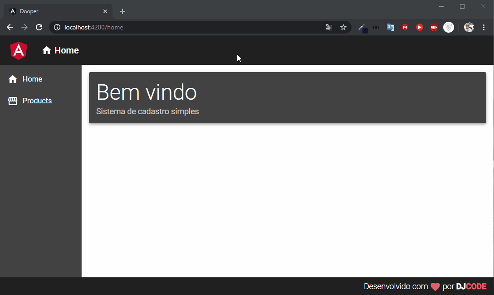

[](https://github.com/dyhalmeida)
[](#)

<h3 align="center"><strong>Dooper</strong> is a web application developed in Angular 9 that performs a CRUD of products</h3>

<div align="center" >
  
</div>

## 📑 Technologies and modules used

This project was developed with the following technologies:

- ✔️ [Angular](https://angular.io/)
- ✔️ [JSON Server](https://rxjs-dev.firebaseapp.com/)
- ✔️ [RXJS](https://rxjs-dev.firebaseapp.com/)
- ✔️ [Angular Material](https://material.angular.io/)

## 📍 Features
- ✔️ Create a product
- ✔️ Update a product
- ✔️ Delete a product
- ✔️ List all products

## 🚀 Getting Started

### 💻 Clone the repository
```bash
git clone https://github.com/dyhalmeida/dooper.git
```

### 💻 Installation
```bash
# In the project folder run
npm install
```

### 💻 Start product fake API
```bash
# In the project folder run
npm run api
```

### 💻 Start Dooper web application
```bash
# In the project folder run
npm start
```

## 🔓 License 
MIT © [Diego Almeida](https://www.linkedin.com/in/dyhalmeida/)